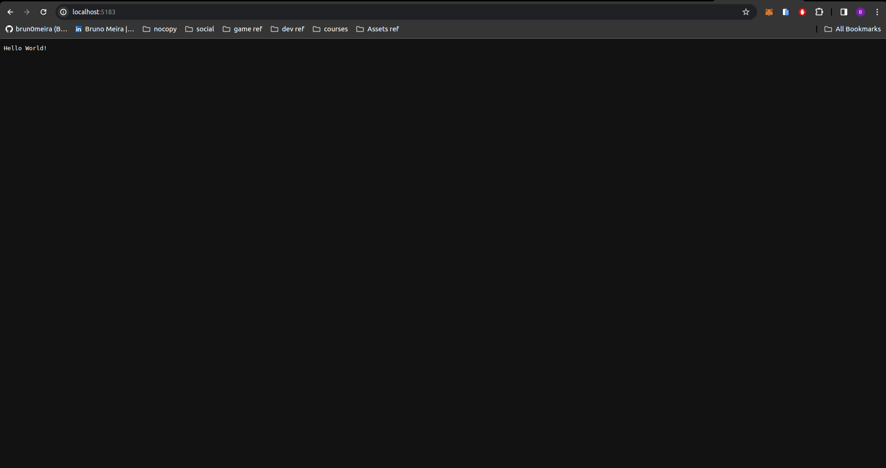
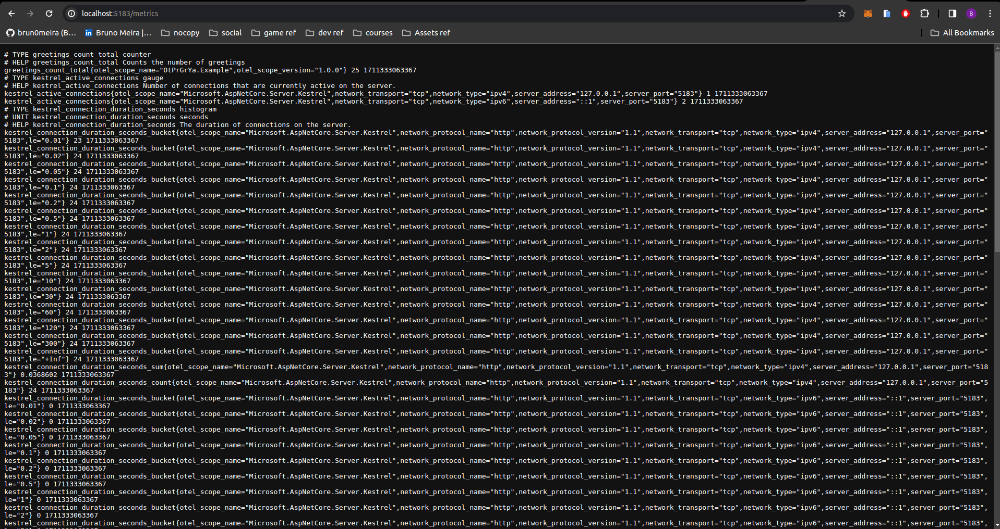
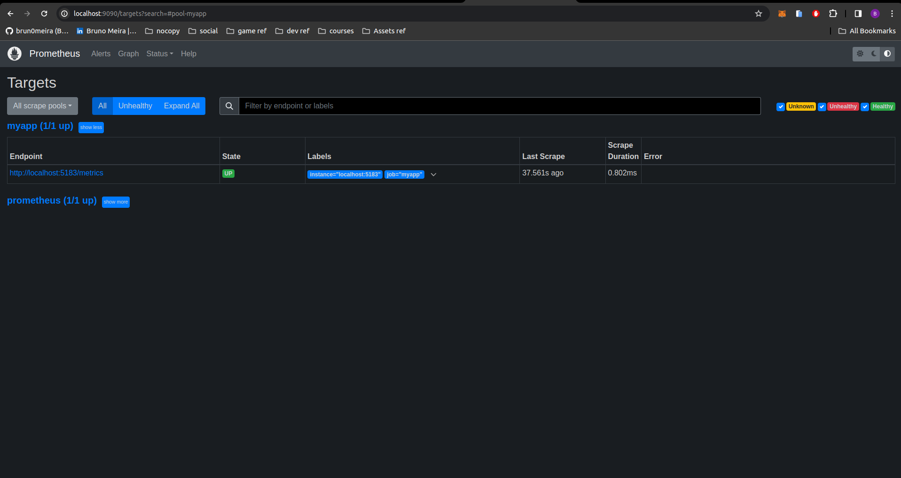
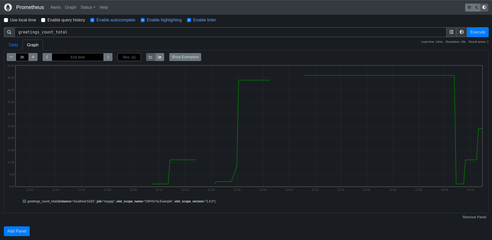
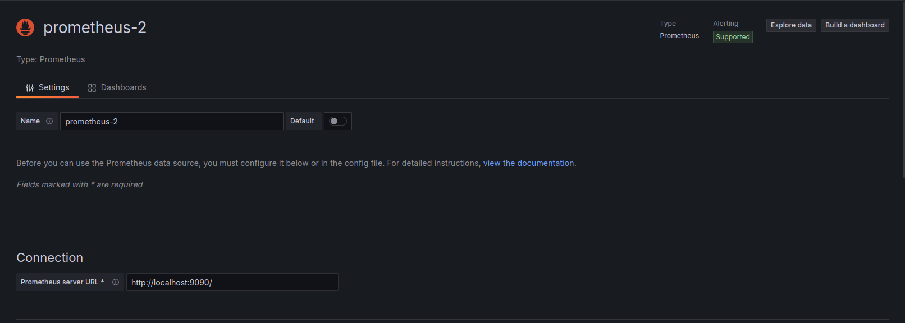
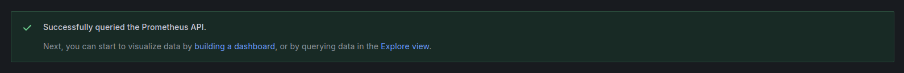
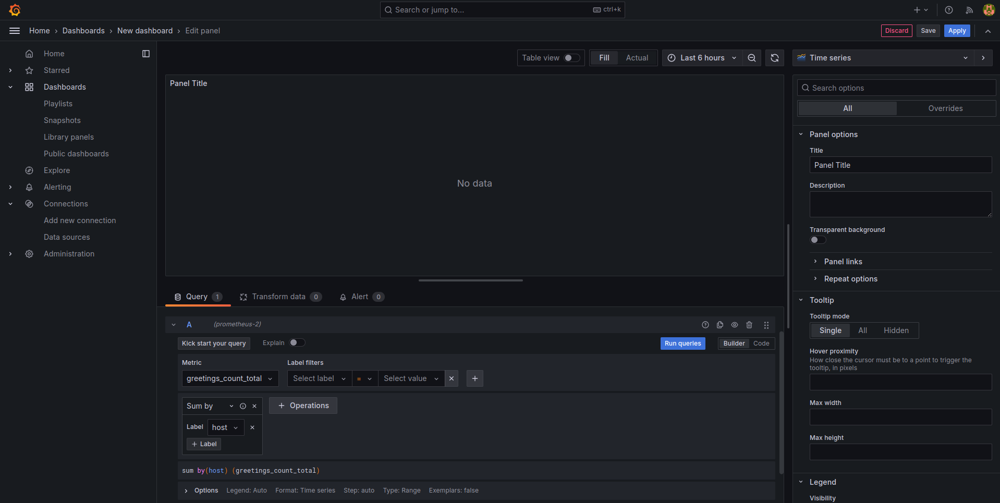
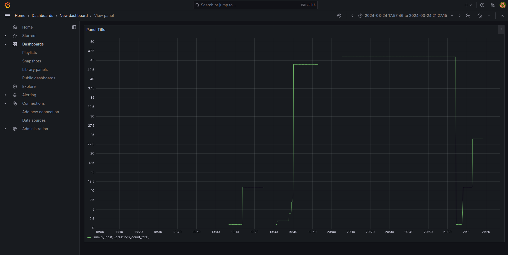
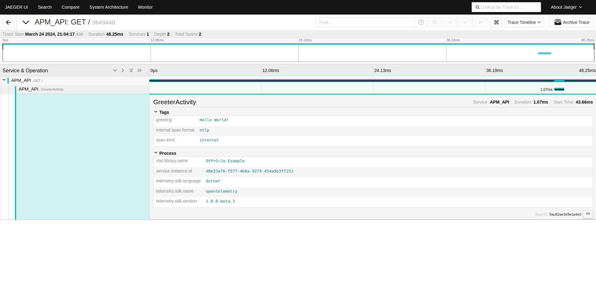

# Instrumentando a aplicação para a coleta de métricas

## Introdução
Esse relatório explora a integração do OpenTelemetry em aplicativos C# e .NET para alcançar observabilidade. Essa implementação aborda conceitos fundamentais de observabilidade, como logs, métricas e rastreamento distribuído, e apresenta o OpenTelemetry como uma solução para coletar e exportar dados de telemetria. Além disso, essa implementação fornece conhecimentos acerca de uma implementação prática, desde a configuração do ambiente até a visualização de métricas e rastreamento distribuído com ferramentas como Prometheus, Grafana e Jaeger.

## Conceitos Aprendidos

### Observabilidade

A observabilidade em sistemas distribuídos refere-se à capacidade de monitorar e analisar a telemetria para entender o estado e o desempenho de cada componente. Os três pilares da observabilidade - logs, métricas e rastreamento distribuído - fornecem insights sobre o comportamento e o desempenho do sistema.

- **Logs:** Registram operações individuais, como solicitações de entrada e falhas em componentes.
- **Métricas:** Medem características do sistema, como o número de solicitações concluídas e a latência.
- **Rastreamento Distribuído:** Permite rastrear solicitações através de vários componentes do sistema para identificar gargalos e problemas.

### OpenTelemetry

O OpenTelemetry é uma plataforma aberta e multiplataforma para coleta e emissão de dados de telemetria. Ele fornece APIs para instrumentação de aplicativos, exportadores para enviar dados telemétricos para sistemas de monitoramento e convenções semânticas para garantir a consistência dos dados.

- **APIs:** Permitem aos desenvolvedores gravar dados de telemetria durante a execução do código.
- **Exportadores:** Enviam dados telemétricos para sistemas de monitoramento, como Prometheus, Jaeger e OTLP.
- **Convenções Semânticas:** Fornecem diretrizes sobre a estrutura e o conteúdo dos dados telemétricos para facilitar a análise.

### Implementação .NET do OpenTelemetry

A implementação .NET do OpenTelemetry utiliza APIs nativas do .NET, como `Microsoft.Extensions.Logging` e `System.Diagnostics.Activity`, para instrumentar aplicativos .NET. Isso permite a coleta de logs, métricas e rastreamento distribuído sem a necessidade de APIs adicionais. Os pacotes do OpenTelemetry fornecem suporte para diferentes aspectos da instrumentação, como ASP.NET Core, gRPC e HttpClient.

## Tecnologias Utilizadas

Nessa implementação, são utilizadas diversas tecnologias e ferramentas para instrumentar a aplicação e coletar métricas. A seguir, uma breve explicação de cada uma delas:

### C#

C# é uma linguagem de programação orientada a objetos, desenvolvida pela Microsoft como parte da plataforma .NET. É amplamente utilizada para o desenvolvimento de aplicativos web, desktop e móveis.

### .NET

.NET é uma plataforma de desenvolvimento de software da Microsoft, que inclui uma grande biblioteca de classes conhecida como Framework Class Library (FCL) e fornece suporte à execução de programas escritos em várias linguagens de programação, como C#, Visual Basic e F#.

### Prometheus

Prometheus é um sistema de monitoramento e alerta de código aberto, que coleta métricas de sistemas e serviços e os armazena em um banco de dados de séries temporais. Ele possui um modelo de dados multidimensional com um poderoso mecanismo de consulta.

#### Instalação do Prometheus

Para instalar o Prometheus, siga os passos abaixo:

1. Faça o download do Prometheus na sua plataforma acessando https://prometheus.io/download/.
2. Extraia os conteúdos do download.
3. Modifique o arquivo de configuração do Prometheus YAML conforme necessário.
4. Inicie o Prometheus executando o arquivo binário.
5. Acesse a interface do usuário do Prometheus no navegador, geralmente disponível em http://localhost:9090/.

### Grafana

Grafana é uma plataforma de análise e monitoramento de código aberto, que permite criar dashboards e gráficos para visualizar métricas de sistemas e serviços. Ele suporta diversos bancos de dados, incluindo Prometheus.

#### Instalação do Grafana

Para instalar o Grafana, siga os passos abaixo:

1. Baixe e instale a versão de software de código aberto do Grafana para sua plataforma.
2. Após a instalação, abra o Grafana no navegador, geralmente disponível em http://localhost:3000/.
3. Configure uma fonte de dados do Prometheus para se conectar ao Prometheus em execução.
4. Crie um dashboard e adicione visualizações para monitorar as métricas coletadas pelo Prometheus.

### Jaeger

Jaeger é um sistema de rastreamento distribuído de código aberto, usado para monitorar e depurar transações distribuídas em sistemas complexos. Ele permite visualizar o fluxo de atividades em uma transação distribuída.

#### Instalação do Jaeger

Para instalar o Jaeger, siga os passos abaixo:

1. Baixe o arquivo de distribuição binária mais recente do Jaeger para sua plataforma.
2. Extraia os conteúdos do download.
3. Execute o arquivo binário Jaeger.
4. Acesse a interface do usuário do Jaeger no navegador, geralmente disponível em http://localhost:16686/.

Com estas ferramentas, é possível monitorar e analisar o desempenho da aplicação, identificar problemas e tomar medidas para melhorar sua eficiência e confiabilidade.

## Passos do Tutorial

O tutorial segue uma abordagem passo a passo para instrumentar um aplicativo .NET com o OpenTelemetry e demonstra como coletar e visualizar métricas e rastreamento distribuído.

1. **Definição de Métricas e Atividades:** Define métricas personalizadas e uma fonte de atividade para o aplicativo.
2. **Criação de um Ponto de Extremidade da API:** Implementa um ponto de extremidade de API simples para enviar saudações.
3. **Referenciamento de Pacotes do OpenTelemetry:** Adiciona os pacotes do OpenTelemetry ao projeto usando o NuGet.
4. **Configuração do OpenTelemetry:** Configura o OpenTelemetry para coletar métricas e rastreamento distribuído e exportá-los para sistemas de monitoramento.
5. **Execução do Projeto:** Executa o projeto e acessa os pontos de extremidade para visualizar métricas e rastreamento distribuído.

## Registros visuais do Processo

### Aplicação rodando - GET SendGreeting

### Aplicação rodando - GET Rastreamento das métricas

### Prometheus - Targets Aplicação

### Prometheus - Métricas representação gráfica

Essa imagem é do Prometheus, o sistema de monitoramento de código aberto que coleta e armazena métricas como séries temporais. O gráfico exibido mostra uma consulta para greetings_count_total, que se alinha com a métrica personalizada incrementada na aplicação. O padrão de degraus do gráfico mostra que a métrica é um contador que aumenta ao longo do tempo correspondendo aos eventos de saudação sendo acionados.

### Grafana - New Data Source

### Grafana - Building a dashboard

### Grafana - Visualização Final

Essa imagem é do Grafana de análise e visualização interativa de código aberto e multiplataforma. Ele oferece gráficos, tabelas e alertas quando conectado a fontes de dados suportadas. A imagem mostra o dashboard Grafana exibindo a mesma métrica greetings_count_total. O Grafana foi usado para criar uma visualização que resume as informações coletadas pelo Prometheus, tornando-as mais acessíveis e fáceis de entender rapidamente.

### Jaeger - Find

### Jaeger - Service and Operation

A imagem mostra um rastreamento de uma requisição GET para a aplicação, incluindo o intervalo "GreeterActivity". Tags e detalhes do processo estão disponíveis, que fornecem contexto para o rastreamento, como a mensagem de saudação específica enviada e a versão da biblioteca usada. A duração e estrutura do rastreamento ajudam a entender as características de desempenho e comportamento do sistema.

## Integração dos serviços

Prometheus coleta e armazena métricas da aplicação, o que ajuda a monitorar o desempenho e saúde operacional. Grafana transforma os dados do Prometheus em visualizações abrangentes, facilitando para os desenvolvedores e operadores a compreensão e ação sobre os dados. Jaeger complementa a coleta de métricas ao fornecer rastreamentos detalhados de requisições individuais, permitindo uma análise profunda de questões de latência e desempenho.

## Conclusão

Esse relatório mostra à instrumentação de aplicativos .NET com o OpenTelemetry para alcançar observabilidade. Ele capacita os desenvolvedores a entenderem e monitorarem o desempenho de seus aplicativos, permitindo a detecção precoce de problemas e a melhoria contínua da experiência do usuário. Além disso, demonstra a integração com ferramentas populares de monitoramento, como Prometheus, Grafana e Jaeger, para uma análise mais avançada dos dados de telemetria.
